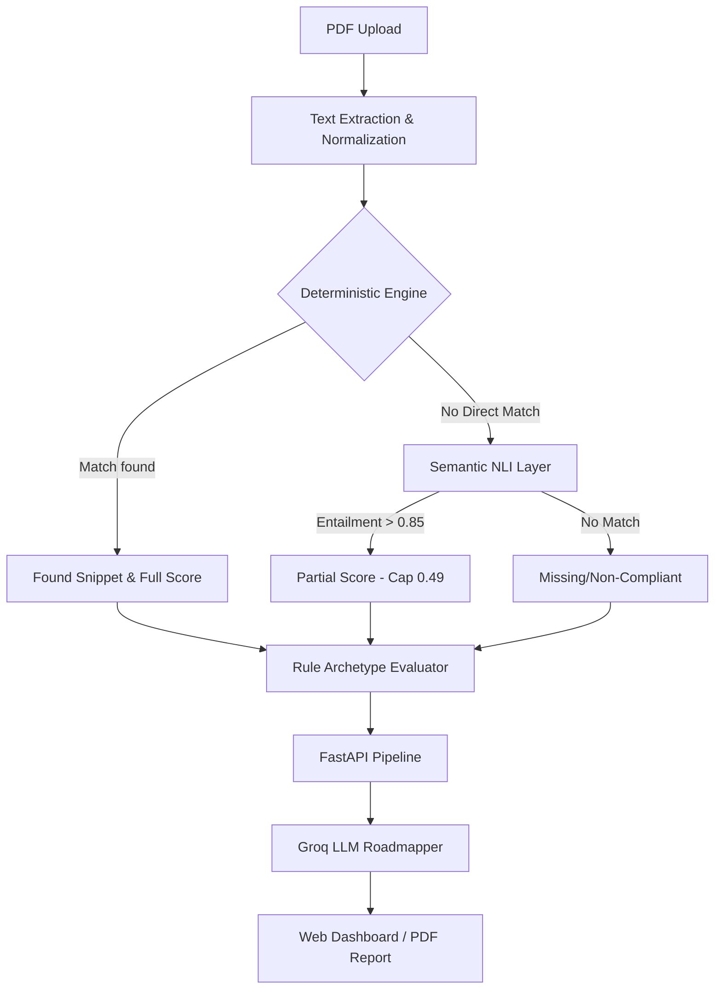

# NABH Compliance Auditor Suite

A premium AI suite designed for **Healthcare Compliance Auditors** to perform automated gap analysis against NABH (National Accreditation Board for Hospitals & Healthcare Providers) standards.

## 🚀 Vision
The suite replaces manual document review with a **Hybrid Deterministic-AI Engine**. It provides a "Results-First" experience, highlighting missing controls and providing an AI-powered roadmap to full accreditation.

---

## 🏗️ Architecture

The system uses a **v2 Stabilized Hybrid Architecture** that balances deterministic precision with semantic intelligence.

### 1. Deterministic Lexical Layer (Exact Match v2)
- **Token-Based Overlap**: Uses NLTK PorterStemmer to normalize text.
- **Robustness**: Matches "procurement" to "procured" and "roles defined" to "defined roles".
- **Threshold**: Requires **60% token overlap** between a rule signal and a document sentence to be considered an "Exact Match".

### 2. Semantic Enhancement Layer (NLI)
- **Model**: `cross-encoder/nli-deberta-v3-small`.
- **Logic**: If exact matching fails, the engine uses **Natural Language Inference (NLI)** to check if the sentence *entails* the compliance requirement.
- **Safeguard**: Compliance found purely via semantic matching is **capped at 0.49 score**, preventing hallucinated compliance.
- **Entailment**: Requires a strict **0.85 confidence score**.

### 3. AI Suggestions Layer
- **Powered by**: Llama-3.1-8b through Groq.
- **Function**: Distills complex engine output into human-readable categories:
  - **Required Documentation**: Missing policies.
  - **Operational Controls**: Workflow changes.
  - **Audit Readiness**: Critical tips for the final inspection.

---

## 🔄 System Flow



---

## 🛠️ Getting Started

### Prerequisites
- Python 3.10+
- `uv` package manager (recommended)
- Groq API Key (stored in `.env`)

### Installation
```bash
# Initialize dependencies
uv sync

# Setup environment
echo "GROQ_API_KEY=your_key_here" > .env
```

### Running the Application
```bash
# Start the FastAPI server (Backend + Frontend)
uv run uvicorn api.main:app --reload
```
Open **[http://localhost:8000](http://localhost:8000)** in your browser.

---

## 📊 Key Features

- **Multi-File Orchestration**: Upload multiple SOPs simultaneously.
- **Compliance Explorer**: Sidebar dedicated to successfully passed clauses with humanized reasoning.
- **Downloadable Intelligence**: Generate professional audit-ready PDFs and raw JSON datasets.

---

## 🧪 Testing with Samples

To test the hybrid engine's performance across different document qualities, you can use the sample files provided in the `checkPdf/` folder:

1. **`strong-doc-10clauses.pdf`**: A high-quality document designed to pass majority of audit checks.
2. **`weak-doc-10clauses.pdf`**: A document with minimal evidence, designed to trigger the "Missing" or "Partial" logic.

Simply drag and drop these into the web dashboard to see the real-time gap analysis and AI-powered roadmap.

---

## ⚠️ Limits & Constraints

- **Lexical Threshold (0.6)**: The engine requires a majority token overlap. Sub-60% matches are ignored by the exact layer.
- **Semantic Cap (0.49)**: You cannot achieve 100% compliance through "vague" semantic matches alone. Physical/Documentary evidence must be detected lexicaly for a full pass.
- **Entailment Gating (0.85)**: The NLI layer is tuned to be "Strictly Conservative" to avoid false positives.
- **PDF Scans**: Text extraction works best on text-layer PDFs. OCR is supported but accuracy depends on image quality.

---

## 📂 Project Structure

- `api/`: FastAPI server and endpoints.
- `engine/`: The core compliance brain (Matcher, Evaluator, Semantic, Suggestions).
- `frontend/`: Premium glassmorphism web dashboard.
- `rules.json`: The deterministic "NABH Rulebook" with signals and archetypes.
- `checkPdf/`: Contains **Input Samples** for testing the engine (e.g., `strong-doc-10clauses.pdf`).
- `reports/`: Storage for **Generated Outputs** (JSON and PDF reports).

---

**Built for specialized Healthcare Auditing.**  
*Disclaimer: This tool is an analysis aid and should be used in conjunction with professional auditor review.*
